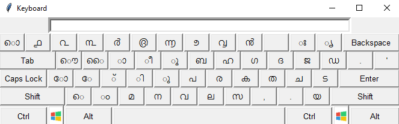
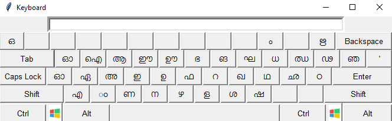
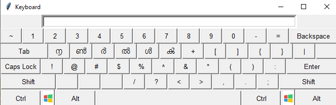
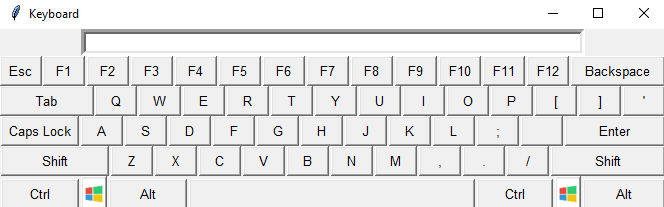
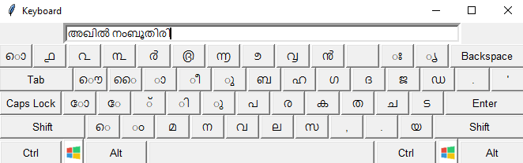

# Malayalam-Keyboard

  
## Initial Keyboard:

## More Alphabets:

## Numbers:

## English Keyboard:

## My name in Malayalam:

<ul>
  <li> Aimed at creating a keyboard for especially Malayalam language using Tkinter</li>
  <li> Devised a Malayalam and English keyboard created using the Tkinter library of Python that gives functionality for both languages </li>
  <li> Designed the app to view the keyboard displayed on one’s screen. The keys displayed were in Malayalam language. Programmed it in a way that the users could view more alphabets, numbers, and operators with just a click of a button </li>
  <li> Click on the shift button on the keyboard to view more alphabets on the keyboard </li>
  <li> Click on the ctrl button to view the numbers and operators</li>
  <li> To view English keyboard,press Alt</li>
<ul>
 

